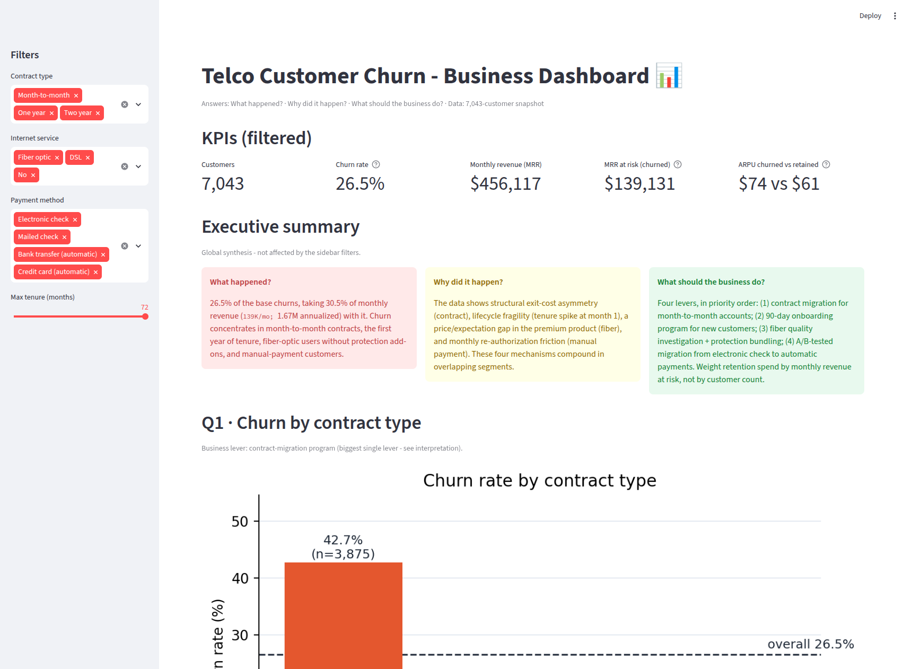
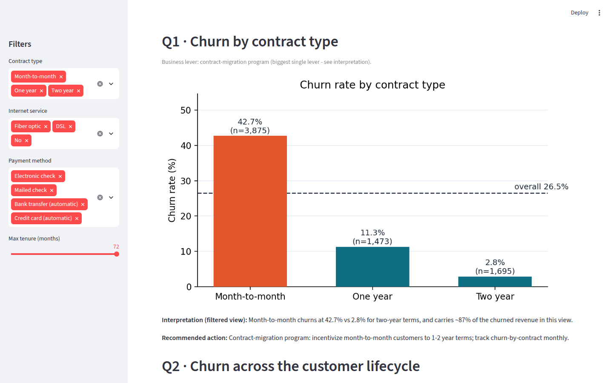
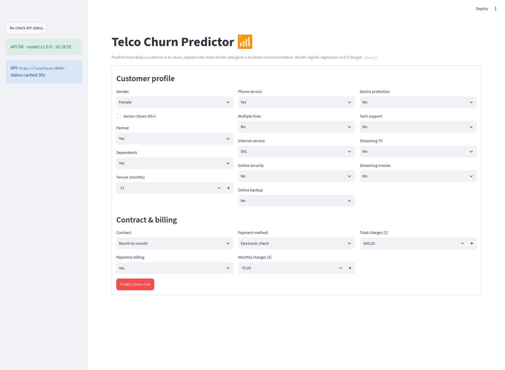
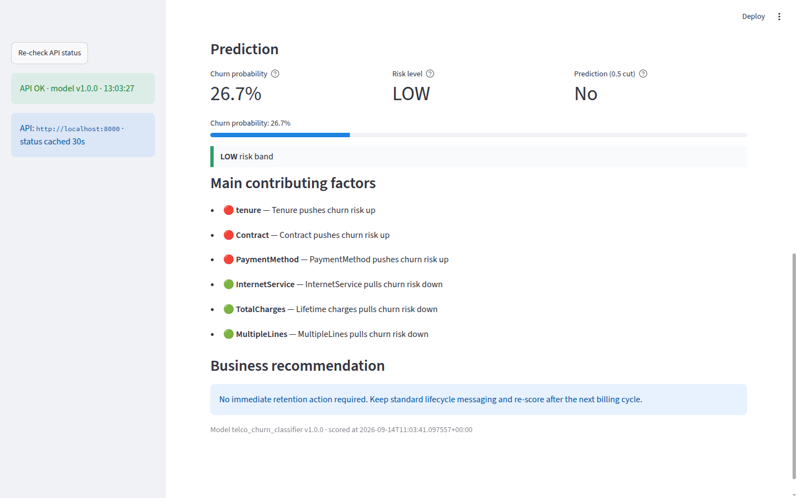
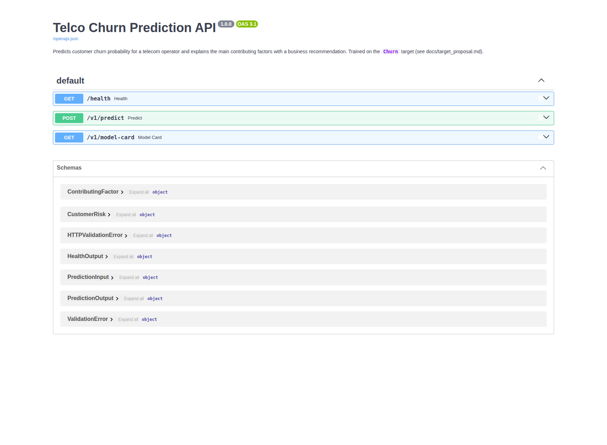

# Telco Customer Churn — End-to-End ML Product


End-to-end analytical solution over the **IBM Telco Customer Churn** dataset
([Kaggle](https://www.kaggle.com/datasets/blastchar/telco-customer-churn),
7,043 customers × 21 columns): data audit, business analysis, a churn model
built on a validated target, served through an API, a predictive Streamlit
app, a business dashboard, and Docker deployment.

## TL;DR

- **Business problem:** 26.5% of customers churn — but churn is concentrated
  in identifiable segments (month-to-month contracts, first-year tenure,
  fiber-optic users, electronic-check payers).
- **Impact at stake:** **$139K/month (30.5% of MRR)** sits in churned
  accounts; churners carry +21.5% ARPU, so revenue-weighted retention matters.
- **Model:** Logistic Regression selected over DT/RF via 5-fold stratified CV —
  test **PR-AUC 0.634**, ROC-AUC 0.842, **top-decile lift 2.78×** — served
  through a REST API that returns probability, per-feature explanations and a
  business recommendation.
- **What's inside:** data audit → business analysis (5 questions with scripts,
  metrics and charts) → target definition → model training → FastAPI →
  Streamlit predictive app → business dashboard → Docker. **20 tests**, no
  notebooks, pinned dependencies.
- **Try it:** `make setup && make train`, then `make api` + `make predict-app`
  — or everything at once with `make docker-up`.

## Screenshots

| Business dashboard (KPIs + executive summary) | Churn driver analysis (Q1) |
| :---: | :---: |
|  |  |

| Predictive app — input form | Predictive app — scored customer |
| :---: | :---: |
|  |  |

API with interactive docs (OpenAPI/Swagger):


## Key findings

- 26.5% of customers churn → **$139K/month (30.5% of MRR, $1.67M annualized)**
  of revenue sits in churned accounts (churners carry +21.5% ARPU).
- Risk concentrates in: **month-to-month contracts (42.7% churn)**, the
  **first year of tenure (55.5% of all churn)**, **fiber-optic users
  (41.9%)**, and **electronic-check payers (45.3%)**.
- Final model: **Logistic Regression** (test PR-AUC 0.634, ROC-AUC 0.842,
  top-decile lift 2.78x). Full story: `docs/model_report.md`.

## Architecture

```
IBM Telco dataset (7,043 × 21)
        │   audit → business analysis → target definition
        ▼
scikit-learn pipeline (median impute + scale · one-hot · logistic regression)
        │   artifacts: final_model.joblib · preprocessor.joblib · model_metadata.json
        ▼
FastAPI  :8000      /health · /v1/predict · /v1/model-card
        │           Pydantic validation · logging · model versioning · explanations
        ├──────────────────────────────┐
        ▼                              ▼
Streamlit Predictive App  :8501   Streamlit Business Dashboard  :8502
(form → probability, drivers,     (KPIs, 5 business questions,
 recommendation)                   filters, actions)

Docker Compose: api :8010 · predict_app :8511 · dashboard :8512
```

## Project structure

```
├── data/raw/                  # Source dataset
├── docs/                      # All reports (md), snippets/, json/, images/
├── scripts/                   # audit/dictionary/proposal scripts, q01..q05, train_*, evaluate_final_model
├── src/data/                  # Shared loaders/utils
├── src/model/                 # Preprocessing pipeline + config helpers
├── src/api/                   # FastAPI app (main, schemas, predict)
├── apps/predict_app/          # Streamlit predictive app
├── apps/dashboard/            # Streamlit business dashboard
├── models/                    # Artifacts (gitignored; regenerate with `make train`) + metadata
├── tests/                     # test_data, test_model, test_api (20 tests)
├── configs/                   # project + model configs (risk bands, split, candidates)
└── Dockerfile, docker-compose.yml, Makefile, requirements.txt
```

## Quickstart

```bash
# Local (pinned deps in a venv)
make setup          # creates venv + installs requirements.txt
make train          # regenerates model artifacts (gitignored)
make test           # 20 tests (data, model, API)
make api            # API on :8000 (Swagger at /docs)
make predict-app    # Streamlit app on :8501
make dashboard      # Business dashboard (run separately: set a different port)
```

### Run the full stack with Docker Compose

```bash
docker compose up -d --build   # one shared image → api + predict_app + dashboard
# API (Swagger):  http://localhost:8010/docs
# Predictive app: http://localhost:8511
# Dashboard:      http://localhost:8512
docker compose down            # stop everything
```

> Prerequisites on a fresh clone: the raw dataset and the model artifacts are
> gitignored — download the CSV from
> [Kaggle](https://www.kaggle.com/datasets/blastchar/telco-customer-churn)
> into `data/raw/` and run `make train` before building; both are bundled
> into the image at build time. Shortcut: `make docker-up`.

Reproduce the full analysis from scratch:

```bash
make audit && make dictionary && make business && make proposal
# target definition confirmed in docs/json/target_approval.json
make train && make test
```

## Pipeline

1. **Data audit** - quality report + data dictionary + problem statement.
2. **Business analysis** - 10 questions → 5 selected, each with script,
   snippet, metrics JSON and chart.
3. **Target definition** - target (`Churn`, classification) evaluated on
   14 criteria and validated before modeling (`docs/json/target_approval.json`).
4. **Model** - baseline + LR/DT/RF candidates (5-fold stratified CV) →
   single test evaluation → artifacts + reports.
5. **API** - FastAPI with validation, logging, versioning and explanations.
6. **Predictive app** - Streamlit form connected to the API.
7. **Dashboard** - business dashboard (KPIs, 5 questions, filters, actions).
8. **Deployment** - Docker Compose (api + predict_app + dashboard).

## Documentation

| Read | To see |
| ---- | ------ |
| [`docs/model_report.md`](docs/model_report.md) + [`model_card.md`](docs/model_card.md) | How candidates were compared, why Logistic Regression won, final test metrics, feature importance and limitations |
| [`docs/target_proposal.md`](docs/target_proposal.md) | How the target variable was evaluated on 14 criteria and defined before modeling |
| [`docs/business_analysis_report.md`](docs/business_analysis_report.md) | The 5 selected business questions with data-backed insights and recommended actions |
| [`docs/data_dictionary.md`](docs/data_dictionary.md) + [`data_quality_report.md`](docs/data_quality_report.md) | Column-level audit: types, domains, leakage flags, missing values, imbalance |
| [`docs/api_documentation.md`](docs/api_documentation.md) | Endpoints, schemas, error handling and request examples |
| [`docs/deployment_documentation.md`](docs/deployment_documentation.md) | Docker architecture, ports and operations |
| [`docs/predict_app_documentation.md`](docs/predict_app_documentation.md) / [`dashboard_documentation.md`](docs/dashboard_documentation.md) | Guides for both Streamlit apps |

## Engineering highlights

- **Target validated before modeling:** the target variable was evaluated on
  14 criteria (business alignment, leakage, data quality, ...) and the
  definition confirmed before any training — recorded with timestamp in
  `docs/json/target_approval.json`.
- **No notebooks:** every number in the reports is reproducible from a script
  in `/scripts` (audit, dictionary, 5 business questions, training,
  evaluation).
- **Tested:** 20 pytest tests covering data contracts, model artifacts and API
  behavior — including regression tests for the explanation logic (protective
  one-hot categories must appear in `decreases_risk`).
- **Explainability from model internals:** per-feature logit contributions
  aggregated by feature group, with protective (risk-lowering) categorical
  drivers preserved and exposed through the API.
- **Single source of truth for risk bands:** thresholds live in
  `configs/model_config.json`, are served by `/v1/model-card` and rendered by
  the app — no hardcoded thresholds in the UI.
- **Reproducible environments:** pinned `requirements.txt`, dedicated venv,
  Docker Compose for the full stack from a clean clone.
