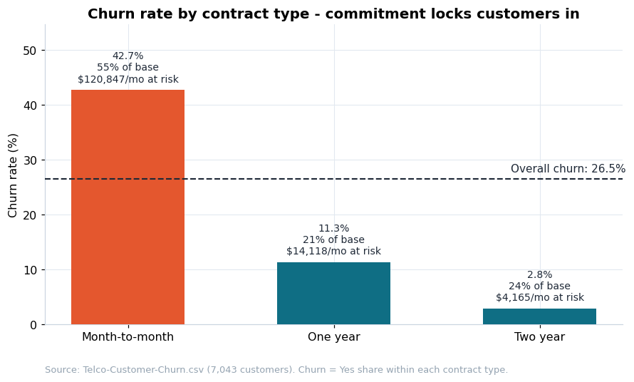
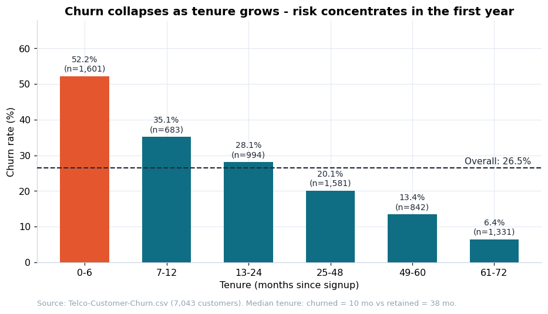
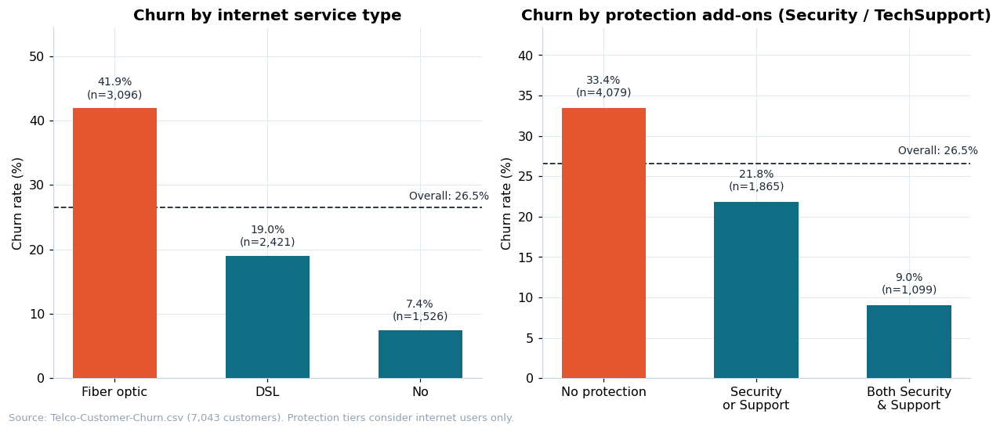
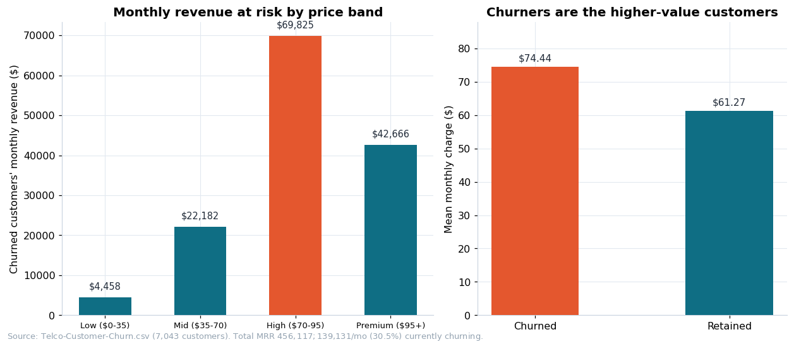
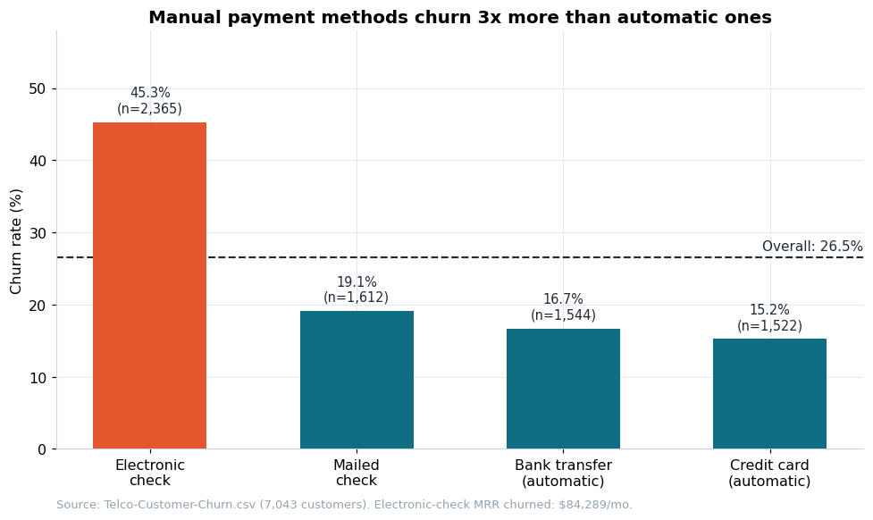

# Business Analysis Report - Telco Customer Churn

> Phase 2 deliverable · Dataset: `data/raw/Telco-Customer-Churn.csv` (7,043 customers × 21 columns) · Generated 2026-09-13
> Inputs: `docs/problem_statement.md`, `docs/data_dictionary.md`, `docs/data_quality_report.md` · Evidence: `docs/snippets/q01-q05_output.md`, `docs/json/q0*_metrics.json`, `docs/images/q0*_chart.png`

## 0. Compliance note

**This phase did not select, rank, or propose any target variable, and did not
train any model.** The `Churn` flag is used here strictly as a descriptive
segmentation key for business questions. Target selection is a separate
Phase 3 process with explicit user approval.

## 1. Executive summary

- The base churns at **26.5%** (1,869 of 7,043 customers).
- Because churners carry **higher-than-average bills** (ARPU $74.44 vs
  $61.27), churned accounts hold **30.5% of all monthly recurring revenue:
  $139.1K/month ≈ $1.67M annualized**.
- Risk is highly concentrated and compoundable:
  - **Contract:** month-to-month churn 42.7% vs 2.8% for two-year (15.1x) -
    and month-to-month accounts carry ~87% of churned MRR.
  - **Lifecycle:** 52.2% churn in the first 6 months vs 6.4% after five years;
    half of all churn happens by month 10.
  - **Product:** fiber optic churns at 41.9% vs 19.0% for DSL, taking
    $114.3K/mo of fiber revenue with it; customers *without* protection
    add-ons churn at 33.4% vs 9.0% with both.
  - **Payment:** electronic-check customers churn at 45.3% (~3x automatic
    methods); e-check × paperless is the leakiest cell at 49.8%.

**What happened:** a quarter of the base is gone, and the revenue leaked is
disproportionate because the leavers were the highest-billed customers.
**Why:** no exit cost (contract), a fragile first year (tenure), a
premium-product expectation gap (fiber), and monthly payment friction
(manual methods) - four compounding mechanisms. **What to do:** four levers in
priority order, detailed in section 8.

## 2. Method

Five questions were selected from ten candidates (see
`docs/business_questions.md`) by business impact, feasibility, and
actionability. Each was answered with a dedicated script
(`scripts/q01…q05_*.py`) that loads the raw data, computes metrics, and writes
its JSON metrics file, markdown snippet, and chart. All monetary figures use
the documented cleaning rule for the 11 blank `TotalCharges` values
(imputed as `tenure × MonthlyCharges`; see `docs/data_quality_report.md`).

## 3. Q1 - Churn by contract type (the structural divide)

| Contract | Customers | Churn rate | Churned MRR | Share of at-risk MRR |
| -------- | --------: | ---------: | ----------: | -------------------: |
| Month-to-month | 3,875 (55.0%) | **42.7%** | $120,847 | 86.9% |
| One year | 1,473 (20.9%) | 11.3% | $14,118 | 10.2% |
| Two year | 1,695 (24.1%) | **2.8%** | $4,165 | 3.0% |

Overall churn: 26.5%. Evidence: `q01_output.md`, `q01_chart.png`.

*Figure Q1 — Month-to-month churns at 15x the two-year rate and carries ~87% of churned revenue.*

**Interpretation.** Exit cost is the strongest structural protection: two-year
customers churn at 1/15th of the month-to-month rate. Worse for the business,
month-to-month customers also pay the highest median charges - the
least-committed segment is the most expensive to lose. ~87% of all churned
revenue sits in a segment the company can address with a single lever.

**Recommended action.** Contract-migration program: target month-to-month
accounts with 1-2 year lock-in incentives (discounts, bundled add-ons),
prioritizing high-value accounts (link to Q4). Track churn-by-contract monthly.

## 4. Q2 - Churn across tenure (the lifecycle gradient)

| Tenure bucket | Customers | Churn rate |
| -------------- | --------: | ---------: |
| 0-6 months | 1,601 | **52.2%** |
| 7-12 months | 683 | 35.1% |
| 13-24 months | 994 | 28.1% |
| 25-48 months | 1,581 | 20.1% |
| 49-60 months | 842 | 13.4% |
| 61-72 months | 1,331 | **6.4%** |

Median tenure at churn: **10 months** vs 38 for retained customers.
Customers in their first 12 months account for **55.5%** of all churn; 613
customers sit at exactly 1 month of tenure. Evidence: `q02_output.md`.

*Figure Q2 — Risk decays monotonically ~8x from the first 6 months to year 5+.*

**Interpretation.** This is lifecycle risk, not customer-quality risk: risk
falls monotonically (~8x from first 6 months to year 5+). The first billing
cycles are the make-or-break window, and month 1 is the cliff.

**Recommended action.** A 90-day onboarding program (proactive setup call,
first-invoice check, expectation management) with month-3 / month-6 cohort
survival as its KPI.

## 5. Q3 - Services and add-ons (the product problem)

| Internet service | Customers | Churn rate |
| ---------------- | --------: | ---------: |
| Fiber optic | 3,096 | **41.9%** |
| DSL | 2,421 | 19.0% |
| No internet | 1,526 | 7.4% |

Protection tiers (OnlineSecurity / TechSupport among internet users):

| Tier | Customers | Churn rate |
| ---- | --------: | ---------: |
| No protection | 4,079 | 33.4% |
| Security or Support | 1,865 | 21.8% |
| Both | 1,099 | **9.0%** |

Every add-on repeats the pattern (e.g., OnlineSecurity: 41.8% without vs
14.6% with). Fiber churned MRR: **$114,300/month** (40.3% of fiber revenue).
Evidence: `q03_output.md`, `q03_chart.png`.

*Figure Q3 — The premium product (fiber) is the leakiest; protection add-ons correlate with 4x lower churn.*

**Interpretation.** The flagship premium product is the leakiest. Two
mechanisms are plausible and non-exclusive: (a) genuine stickiness from
bundling, and (b) selection - dissatisfied fiber customers buy fewer add-ons.
Either way, the unprotected-fiber segment is both large and leaky, and fiber
service quality (installation, outages, expectation gap vs premium price of
$91.68 median) deserves a root-cause investigation.

**Recommended action.** 1) Fiber quality investigation. 2) Bundle Security +
Support into fiber onboarding at promotional price. 3) Track the
protected-vs-unprotected gap as a leading indicator.

## 6. Q4 - Revenue at risk (turning churn into dollars)

| Price band | Customers | Churn rate | MRR | Churned MRR | Share of at-risk MRR |
| ---------- | --------: | ---------: | --: | ----------: | -------------------: |
| Low ($0-35) | 1,735 | 10.9% | $38,217 | $4,458 | 3.2% |
| Mid ($35-70) | 1,725 | 23.9% | $94,597 | $22,182 | 15.9% |
| High ($70-95) | 2,288 | 37.1% | $188,751 | $69,825 | **50.2%** |
| Premium ($95+) | 1,295 | 32.3% | $134,551 | $42,666 | 30.7% |

Total MRR **$456,117**; churned MRR **$139,131 (30.5%)**; annualized
**$1.67M**. ARPU churned **$74.44** vs retained **$61.27** (+21.5%).
Evidence: `q04_output.md`, `q04_chart.png`.

*Figure Q4 — The $70-95 band alone holds half of the at-risk revenue.*

**Interpretation.** Churn is value-weighted, not just volumetric: the
$70-95 band alone holds half of all at-risk revenue. Retention spend should
follow dollars, not headcount.

**Recommended action.** 1) Revenue-weight retention budget toward $70+
accounts. 2) Audit the $95+ premium bundle's price-value gap. 3) Report
"monthly revenue at risk" as the primary KPI.

## 7. Q5 - Payment method and billing mode (the friction signal)

| Payment method | Customers | Churn rate |
| -------------- | --------: | ---------: |
| Electronic check | 2,365 | **45.3%** |
| Mailed check | 1,612 | 19.1% |
| Bank transfer (automatic) | 1,544 | 16.7% |
| Credit card (automatic) | 1,522 | 15.2% |

Paperless billing: Yes 33.6% vs No 16.3%. Compounding cell - e-check ×
paperless: **49.8% churn** (vs 32.7% e-check × paper, 21.9% auto × paperless,
11.8% auto × paper). E-check churned MRR: **$84,289/month**. Evidence:
`q05_output.md`, `q05_chart.png`.

*Figure Q5 — Electronic-check customers churn ~3x the automatic methods.*

**Interpretation.** Manual payment correlates with ~3x churn vs automatic;
the effect compounds with paperless billing. Hypothesis: manual payment
creates a monthly re-authorization decision point where the customer
re-assesses the service; automatic payments remove that trigger. This is
correlation - payment type also proxies for customer profile - so the
recommended intervention is designed as an experiment.

**Recommended action.** A/B-tested migration campaign from e-check to
automatic payments (small discount or one-time credit), starting with the
e-check + paperless cell.

## 8. Synthesis - what, why, and what to do

- **What happened?** 26.5% of the base churned, and because churners skew
  high-value, 30.5% of MRR ($139K/mo, $1.67M annualized) left with them.
- **Why did it happen?** Four compounding mechanisms: no exit cost
  (month-to-month contracts at 42.7% churn), lifecycle fragility (first-year
  risk > 50%, median churn tenure 10 months), a premium-product expectation
  gap (fiber at 41.9%), and monthly re-authorization friction (e-check at
  45.3%). Each mechanism concentrates in identifiable, addressable segments.
- **What should the business do?** Four levers in priority order:
  1. **Contract migration** for month-to-month accounts (biggest single lever;
     ~87% of at-risk revenue).
  2. **90-day onboarding** for customers with < 1 year tenure (55% of churn).
  3. **Fiber quality investigation + protection bundling** (flagship product
     leaking $114K/mo; protection correlates with 9% churn).
  4. **Payment migration A/B test** (e-check → automatic; leakiest cell 49.8%).
  Retention spend should be weighted by monthly revenue at risk per segment,
  not by customer counts.

## 9. Limitations

- **Cross-sectional data.** One snapshot: no cohort time series, so "churn
  rate" here is the flag's prevalence in the snapshot, not a true period rate.
- **Correlation ≠ causation.** Segment differences (e.g., payment method) may
  proxy for customer profile; A/B tests are required before causal claims.
- **No service-quality or competitor data.** The fiber gap hypothesis cannot
  be tested with this dataset alone.
- **Synthetic sample.** The IBM Telco dataset is a curated sample; magnitudes
  may not match a real operator exactly.

## 10. Compliance note (repeated)

**No target variable was selected or proposed in this phase, and no model was
trained.** The outputs of this phase feed Phase 3 (target proposal), which
requires explicit user approval before any modeling begins.
