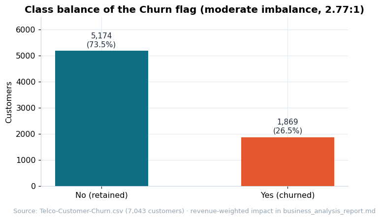
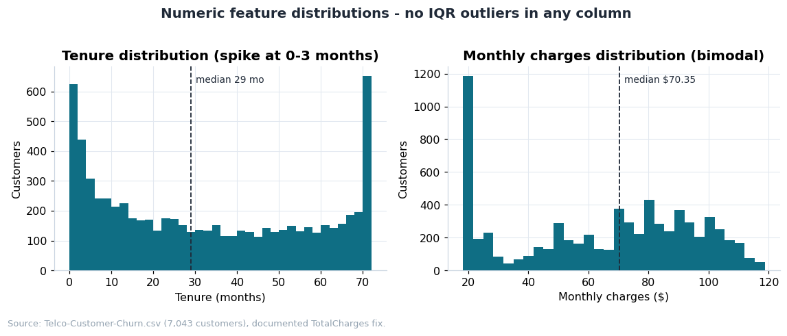

# Data Quality Report - Telco Customer Churn

> Generated: 2026-09-13 17:20 UTC · Source: `data/raw/Telco-Customer-Churn.csv` · Rows: 7,043 · Columns: 21

## 1. Dataset overview

- **Rows:** 7,043 · **Columns:** 21
- **Data source reference:** IBM Telco Customer Churn sample dataset — Kaggle: https://www.kaggle.com/datasets/blastchar/telco-customer-churn (public sample data distributed by IBM for Cognos Analytics). 7,043 customers of a fictional US telecom operator.
- **Grain:** one row = one customer snapshot (contract, services, billing, churn flag).
- **Customers with zero tenure (brand new):** 11

## 2. Missing values

| Column | Explicit NaN | Implicit blanks (' ') | After numeric coercion |
| ------ | -----------: | --------------------: | ----------------------: |
| `TotalCharges` | 0 | 0 | 11 |

Only `TotalCharges` is affected: **11 rows (0.16%)** store an empty string instead of a number. All 11 belong to customers with `tenure = 0` (brand-new customers billed once, whose `MonthlyCharges` is their first invoice). No other column has missing values.

## 3. Duplicated rows

- Duplicated full rows: **0**
- Duplicated `customerID`: **0** -> `customerID` is a clean primary key.

## 4. Constant columns

None. Every column has at least two distinct values.

## 5. Data type issues

| Column | Declared type | Issue | Recommendation |
| ------ | ------------- | ----- | -------------- |
| `TotalCharges` | string | 11 blank strings `" "` stored in an otherwise numeric column | Coerce with `pd.to_numeric(errors="coerce")`; impute the 11 new customers as `tenure × MonthlyCharges` (or drop, 0.16%) |
| `SeniorCitizen` | int64 (0/1) | Numeric encoding of a binary flag | Treat as categorical boolean in analysis |
| `Churn` | string (Yes/No) | Text encoding of a binary outcome | Map to {0, 1} only downstream, once a target is formally approved |

Structural category values (`"No phone service"`, `"No internet service"`) are consistent and are not errors: they encode service dependencies (add-ons require the underlying service).

## 6. Outliers (IQR rule, 1.5 × IQR)

| Column | Min | Median | Mean | Max | Std | IQR outliers |
| ------ | --: | -----: | ---: | --: | --: | -----------: |
| `tenure` | 0.00 | 29.00 | 32.37 | 72.00 | 24.56 | 0 |
| `MonthlyCharges` | 18.25 | 70.35 | 64.76 | 118.75 | 30.09 | 0 |
| `TotalCharges` | 0.00 | 1,394.55 | 2,279.73 | 8,684.80 | 2,266.79 | 0 |

No IQR outliers in any numeric column. `TotalCharges` is naturally right-skewed (accumulation of monthly invoices over tenure) but the skew comes from long-tenure customers, not erroneous values.

## 7. Class imbalance (outcome-like flag)

- The only outcome-like flag in the dataset is `Churn` (Yes: 1,869 = 26.54%, No: 5,174 = 73.46%).
- Imbalance ratio (No : Yes) = 2.77 : 1 — a **moderate imbalance**. If this flag were ever used for predictive modeling, plain accuracy would be a misleading metric and stratified sampling / PR-style metrics would be required.

*Figure 1 — Class balance of the outcome-like flag (chart: `scripts/03_doc_charts.py`).*

## 8. Basic distributions

### Numeric columns

| Column | Min | Q1 | Median | Q3 | Max | Mean |
| ------ | --: | -: | -----: | -: | --: | ---: |
| `tenure` | 0.00 | 9.00 | 29.00 | 55.00 | 72.00 | 32.37 |
| `MonthlyCharges` | 18.25 | 35.50 | 70.35 | 89.85 | 118.75 | 64.76 |

- `tenure` is fairly flat across 0-72 months (median 29), with a visible spike of brand-new customers (tenure < 3 months).

*Figure 2 — Numeric feature distributions (chart: `scripts/03_doc_charts.py`).*

### Categorical columns (top values)

| Column | Top values (count) |
| ------ | ------------------ |
| `gender` | `Male` (3555), `Female` (3488) |
| `Partner` | `No` (3641), `Yes` (3402) |
| `Dependents` | `No` (4933), `Yes` (2110) |
| `PhoneService` | `Yes` (6361), `No` (682) |
| `MultipleLines` | `No` (3390), `Yes` (2971), `No phone service` (682) |
| `InternetService` | `Fiber optic` (3096), `DSL` (2421), `No` (1526) |
| `OnlineSecurity` | `No` (3498), `Yes` (2019), `No internet service` (1526) |
| `OnlineBackup` | `No` (3088), `Yes` (2429), `No internet service` (1526) |
| `DeviceProtection` | `No` (3095), `Yes` (2422), `No internet service` (1526) |
| `TechSupport` | `No` (3473), `Yes` (2044), `No internet service` (1526) |
| `StreamingTV` | `No` (2810), `Yes` (2707), `No internet service` (1526) |
| `StreamingMovies` | `No` (2785), `Yes` (2732), `No internet service` (1526) |
| `Contract` | `Month-to-month` (3875), `Two year` (1695), `One year` (1473) |
| `PaperlessBilling` | `Yes` (4171), `No` (2872) |
| `PaymentMethod` | `Electronic check` (2365), `Mailed check` (1612), `Bank transfer (automatic)` (1544), `Credit card (automatic)` (1522) |
| `Churn` | `No` (5174), `Yes` (1869) |

### Pricing structure (group medians of `MonthlyCharges`)

| Internet service | Median monthly charge |
| ---------------- | --------------------: |
| `DSL` | $56.15 |
| `Fiber optic` | $91.68 |
| `No` | $20.15 |

| Contract | Median monthly charge |
| -------- | --------------------: |
| `Month-to-month` | $73.25 |
| `One year` | $68.75 |
| `Two year` | $64.35 |

## 9. Initial hypotheses (validated in the business analysis report)

1. **Contract commitment drives retention.** 55% of the base is on month-to-month contracts; lock-in contracts (1-2 years) plausibly reduce churn. Highest-impact hypothesis to validate.
2. **New customers are the fragile segment.** A tenure spike at 0-3 months plus 11 zero-tenure rows suggests onboarding is a churn-critical window.
3. **Fiber optic is the premium - and possibly problematic - product.** It carries a median monthly charge of $91.68 vs $56.15 for DSL; premium price with under-delivered expectations is a classic churn driver.
4. **Payment friction may matter.** 33.6% of customers pay by electronic check (manual, non-recurring); manual payment methods often correlate with churn vs automatic payments.
5. **Revenue concentration risk.** With ARPU around $65 and 26.5% of customers flagged as churned, the business impact of churn is material; revenue at risk must be quantified.
