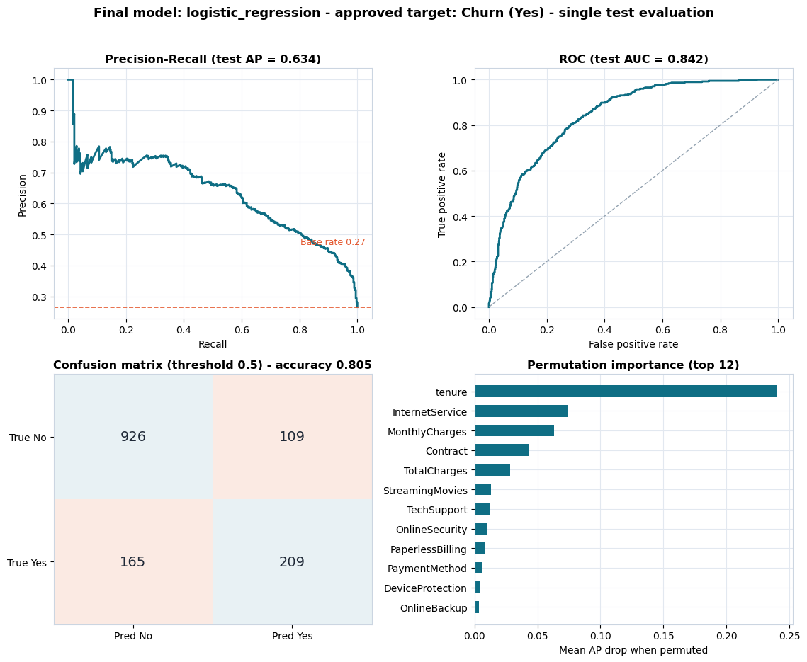

# Model Card - Telco Churn Classifier v1.0.0

## Overview

| Field | Value |
| ----- | ----- |
| Model name | `telco_churn_classifier` |
| Version | 1.0.0 |
| Task | Binary classification (churn prediction) |
| Approved target | `Churn` (positive class: `Yes`) — Phase 3 approval in `docs/json/target_approval.json` |
| Selected algorithm | Logistic Regression (C=1.0, max_iter=1000) inside a preprocessing Pipeline |
| Training data | IBM Telco Customer Churn snapshot, 7,043 customers |
| Split | Train 4,225 / Validation 1,409 / Test 1,409 (stratified, seed 42) |
| Primary metric | PR-AUC (average precision) — business-aligned given 26.5% base rate |
| Training timestamp | see `models/model_metadata.json` |

## Intended use

Prioritize retention actions (contract migration, onboarding care, bundle
offers, payment migration) by ranking customers with a churn probability and
assigning risk bands: **high ≥ 0.60**, **medium ≥ 0.35**, **low < 0.35**.
Intended users: marketing/retention teams of the operator via the API and
predictive app.

## Performance (single evaluation on held-out test set)

| Metric | Value |
| ------ | ----: |
| ROC-AUC | 0.842 |
| PR-AUC | 0.634 |
| Accuracy | 0.806 |
| Precision | 0.657 |
| Recall | 0.559 |
| F1 | 0.604 |
| Brier | 0.138 |
| Top-decile lift | 2.78x (catches 27.8% of churners) |

Confusion matrix (threshold 0.5): TN 926 · FP 109 · FN 165 · TP 209.

*Visual summary: PR curve, ROC curve, confusion matrix and permutation importance (single test evaluation). Full report: `docs/model_report.md`.*

## Key drivers (permutation importance, AP drop)

1. `tenure` (0.24) — early-tenure customers are the risk core
2. `InternetService` (0.07) — fiber users churn more
3. `MonthlyCharges` (0.06) — higher bills, higher risk
4. `Contract` (0.04) — month-to-month is riskier
5. `TotalCharges`, `StreamingMovies`, `TechSupport`, `OnlineSecurity`, ...

## Out-of-scope / limitations

- Not for causal claims or individual "will definitely churn" guarantees;
  outputs are ranking probabilities.
- No temporal validation (single snapshot); retrain on fresh data before
  long-term production use.
- Demographic features (gender, SeniorCitizen) are included as approved;
  a fairness audit is recommended before customer-facing automation.
- Retrain/discard if the business changes contract or pricing structure.

## Artifacts and provenance

- Model: `models/final_model.joblib` (Pipeline: preprocessor + classifier)
- Preprocessor: `models/preprocessor.joblib`
- Metadata: `models/model_metadata.json`
- Full report: `docs/model_report.md` · Metrics: `docs/json/model_performance.json`
- Feature importance: `docs/json/feature_importance.json`
- Config: `configs/model_config.json`
